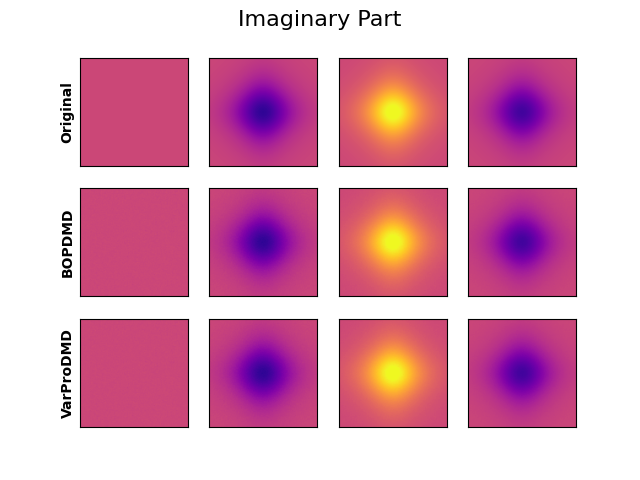

# pydmdstats
[Askham et al.](https://epubs.siam.org/doi/abs/10.1137/M1124176) introduced the variable projection for the Dynamic Mode Decomposition (DMD).\
This repository compares two implementations of the variable projection method for DMD ([BOPDMD](https://github.com/PyDMD/PyDMD/blob/master/pydmd/bopdmd.py) originally introduced by [Sashidar and Kutz](https://royalsocietypublishing.org/doi/abs/10.1098/rsta.2021.0199), [VarProDMD](https://github.com/greinerth/PyDMD/blob/feature/varpro/pydmd/varprodmd.py)) 
w.r.t. overall optimization runtime and signal reconstruction capabilities.
BOPDMD reduces to the classic variable projection\
if only *one* model is considered. The preselection $\widetilde{\boldsymbol{X}} \in \mathbb{C}^{n \times k}$ of original measurements $\boldsymbol{X} \in \mathbb{C}^{n \times m}, k < m$ can in some cases accelerate the optimization. The preselection is achieved by QR-Decomposition with Column Pivoting. This project mainly focuses on the python implementations.\
Note that in Python the execution times vary, due to system calls or waiting for resources.

## Setup
The easiest way to run the scripts is to use [VSCode's devcontainer capability](https://code.visualstudio.com/docs/devcontainers/containers). The project was tested on Ubuntu 22.04 (which also was used as a host system for the devcontainers) with the Python3.11 interpreter. For visualization of the results.

### Ubuntu 22.04
To visualize the results some prerequisites are necessary.\
First, download this repository and execute the following commands 
```
cd /path/to/repository
python3.11 -m pip --user install -e .
python3.11 -m --user -e git+https://github.com/greinerth/PyDMD.git@feature/varpro#egg=pydmd
```
For proper visualization of the results make sure LaTex is installed.\
For a minimal installation open another command line window and execute
```
sudo apt update
sudo apt upgrade -y
sudo apt install texlive-xetex cm-super dvipng -y
```
### VSCode Devcontainer (Ubuntu 22.04 as host system)
Open the repository, press `CTRL + SHIFT + P`, and type `Devcontainers: Rebuild and Reopen in Container`.\
After everything is ready to run.

### Running the Experiments
After the setup phase execute
```
run_mrse -o /path/to/output/
```
for running the spatiotemporal signal experiment.
For additional information please type
```
run_mrse -h
```

For the more complex experiments e.g. type
```
run_ssim -f moving_points -o /path/to/output
```
For detailed information type
```
run_ssim -h
```
Not that some of the experiments require a lot of time (especially the sea surface temperature experiment (global_temp)).\
The experiments also artificially corrupt the original signal with noise. Further, different compression rates (library selection) are considered.\
The results are stored in a .pkl file.
### Visualize Results
After the experiments were run you can easily visualize the runtime statistics.\
Here is an example of how to visualize the sea surface temperature experiment
```
visualize_stats -p output/SSIM_global_temp.pkl
```
## Low dimensional library selection scheme
Here is a visualization of how the QR decomposition with Column Pivoting (greedily) selects samples\
in the projected space.\
The selection is performed on a *complex* spatiotemporal signal, which is also used in the experiments.\
||
|:--:|
|*Spatiotemporal signal: Real- and imaginary part of the signal. Dashed lines indicate library selection in low-dimensional space.*|

||
|:--:|
|*Spatiotemporal signal: Reconstructed real- and imaginary parts of the signal. (VarProDMD)*|

## Results
All experiments consider different compressions and varying noise corruption.\
The parameters used for the experiments are the default values of the different scripts (`run_mrse, run_ssim`).

### Spatiotemporal Signal
||
|:--:|
|*Spatiotemporal Signal experiment: Expected runtime for BOPDMD and VarProDMD.*|

### Damped Oscillations
The damped oscillation experiment (taken from [here](https://github.com/PyDMD/PyDMD/blob/master/tutorials/tutorial2/tutorial-2-adv-dmd.ipynb)) consists of $64$ *complex* $128 \times 128 \: px$ images.
||
|:--:|
|*Damped Oscillations: The top row denotes the original real (noisy) signal. The bottom rows are the reconstructions of the different approaches.*|

||
|:--:|
|*Damped Oscillations: The top row denotes the original imaginary signal. The bottom rows are the reconstructions of the different approaches.*|

||
|:--:|
|*Damped Oscillations experiment: Expected runtime for BOPDMD and VarProDMD.*|

### Moving Points
The moving point experiments consider $128$ samples and consist of $128 \times 128 \: px$ images.
||
|:--:|
|*Moving Points experiment: The top row denotes the original (noisy) signal. The bottom rows are the reconstructions of the different approaches.*|

||
|:--:|
|*Moving Points: Expected runtime for BOPDMD and VarProDMD. Compression accelerates the optimization.*|

### Sea Surface Temperature
The sea surface temperature experiment considers the last $128$ measurements of the [sst dataset](https://downloads.psl.noaa.gov/Datasets/noaa.oisst.v2.highres/sst.day.mean.ltm.1982-2010.nc).
Each recording consists of $720 \times 1440\: px$.

|\|
|:--:|
|*Global sea surface temperature: The optimization is performed on the last 128 samples of the dataset. Three preselected samples/reconstructions are shown. The top row shows the original (noisy) signal. The bottom rows are the reconstructions of the different approaches.*|

||
|:--:|
|*Global sea surface temperature: Expected runtime for BOPDMD and VarProDMD.*|
