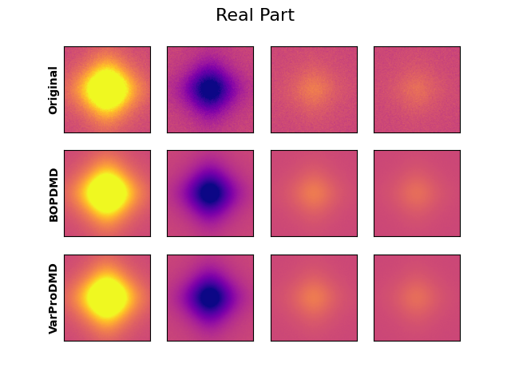
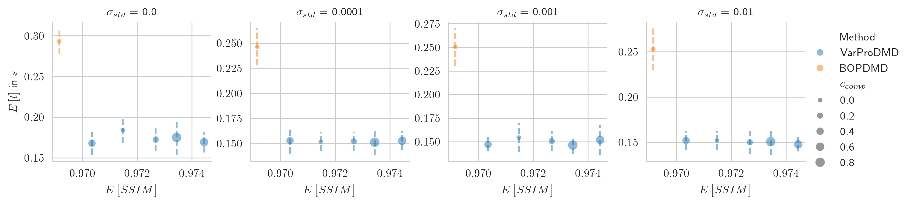
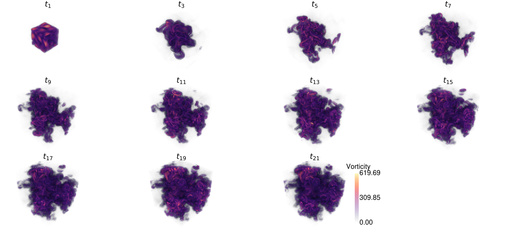

# pydmdstats

[Askham et al.](https://epubs.siam.org/doi/abs/10.1137/M1124176) introduced the
variable projection for Dynamic Mode Decomposition (DMD).\
This repository compares two implementations of the variable projection method for
DMD ([BOPDMD](https://github.com/PyDMD/PyDMD/blob/master/pydmd/bopdmd.py) originally
introduced by [Sashidar and Kutz](https://royalsocietypublishing.org/doi/abs/10.1098/rsta.2021.0199),
[VarProDMD](https://github.com/greinerth/PyDMD/blob/feature/varpro/pydmd/varprodmd.py))
w.r.t. overall optimization runtime and signal reconstruction capabilities. BOPDMD
reduces to the classic variable projection\
if only _one_ model is considered. The preselection
$\widetilde{\boldsymbol{X}} \in \mathbb{C}^{n \times k}$ of original
measurements $\boldsymbol{X} \in \mathbb{C}^{n \times m}, k < m$ can in some
cases accelerate the optimization. The preselection is achieved by
QR-Decomposition with Column Pivoting. This project mainly focuses on the python
implementations.\
Note that in Python the execution times vary, due to system calls or waiting for
resources.

## Setup

The easiest way to run the scripts is to use
[VSCode's devcontainer capability](https://code.visualstudio.com/docs/devcontainers/containers).
The project was tested on Ubuntu 22.04 (which also served as a host system for
the dev containers) with the Python3.11 and Python3.12 interpreters.

### Ubuntu 22.04

To visualize the results some prerequisites are necessary.\
First, download this repository and execute the following commands

```
cd /path/to/repository
pip --user install -e .
```

For proper visualization of the results make sure LaTex is installed.\
For a minimal installation open another command line window and execute

```
sudo apt update
sudo apt upgrade -y
sudo apt install texlive-xetex cm-super dvipng -y
```

### VSCode Devcontainer (Ubuntu 22.04 as host system)

Open the repository, press `CTRL + SHIFT + P`, and type
`Devcontainers: Rebuild and Reopen in Container`.\
After everything is ready to run.

### Running the Experiments

After the setup phase execute

```
run_mrse -o /path/to/output/
```

for running the spatiotemporal signal experiment. For further information,
please type

```
run_mrse -h
```

For the more complex experiments e.g. type

```
run_ssim -f moving_points -o /path/to/output
```

For detailed information type

```
run_ssim -h
```

You may also modify the optimizer within the experiments. Within your specified
path a subfolder with the name of the optimizer used for the experiment is
created. Note that some of the experiments require a lot of time.\
The experiments also artificially corrupt the original signal with noise. Further,
different compression rates (library selection) are considered. The results are stored
in a .pkl file.

### Visualize Results

After the experiments were run you can easily visualize the runtime statistics.\
Here is an example of how to visualize the sea surface temperature experiment

```
visualize_stats -p experiments/output/lm/MRSE_highdim_100_linear.pkl
```

## Library Selection Scheme

Here is a visualization of how the QR decomposition with Column Pivoting
(greedily) selects samples of a spatiotemporal signal\
in the original (high-dimensional) space. The spatiotemporal signal is also utilized
in the experiments (cf. section **Spatiotemporal Dynamics**).

Within the experiments, the library selection in general is performed in the
_projected_\
low dimensional space:

```math
\hat{\boldsymbol{X}} = \boldsymbol{U}^*\boldsymbol{X} = \boldsymbol{\Sigma V}^*
```

The formula on how to generate the spatiotemporal dynamics is described in
section **Spatiotemporal Dynamics**.\
The signal consists of $100$ measurements with $1024$ entries $\left(\boldsymbol{X} \in \mathbb{C}^{1024 \times 100}\right)$.\
The compression is set to $c = 0.8$, hence $20$ samples are utilized for the
optimization.

|                                                                               |
| :---------------------------------------------------------------------------------------------------------------------------------: |
| _Spatiotemporal signal: Real- and imaginary part of the signal. Dashed lines indicate library selection in high dimensional space._ |

|                                                                     |
| :----------------------------------------------------------------------------------------------------------------------------: |
| _Spatiotemporal signal: Reconstructed real- and imaginary parts of the signal. The reconstruction is performed with VarProDMD_ |

## Results

All experiments consider different compressions and varying (zero-mean Gaussian)
noise corruption with a standard deviation
$\sigma_{std} \in \{0.0001, 0.001, 0.01\}$.\
Each experiment is executed 100 times. The optimization is performed in the projected
(low-dimensional) space. The parameters used for the experiments are the default
values of the different scripts (`run_mrse, run_ssim`).\
Depending on the experiment either the mean/expected mean root squared error
($E\left[d\right]$) or the mean/expected Structural Similarity Index
($E\left[SSIM\right]$) is computed.\
For $E\left[d\right]$ a low runtimes and a low error are desired. For $E\left[SSIM\right]$
a value close to 1 is desired, while also having a low expected runtime.

### Spatiotemporal Dynamics

The formula for generating the spatiotemporal dynamics (taken from
[here](https://epubs.siam.org/doi/book/10.1137/1.9781611974508)):

```math
f\left(x, t\right) = \frac{1}{\cosh\left(x + 3\right)}\exp\left(j2.3t\right) + \frac{2}{\cosh\left(x\right)}\tanh\left(x\right)\exp\left(j2.8t\right)
```

|                                                                                                                                                                                                                                            |
| :--------------------------------------------------------------------------------------------------------------------------------------------------------------------------------------------------------------------------------------------------------------------------------------------: |
| _Spatiotemporal Signal experiment: Expected runtime for BOPDMD and VarProDMD. A dashed ellipse indicates error- and time covariance. A dashed line is a collapsed ellipse. In this case, only the execution times vary. VarProDMD uses Trust Region Optimization (TRF) during the experiment._ |

### Oscillations

The oscillation experiment (taken from
[here](https://github.com/PyDMD/PyDMD/blob/master/tutorials/tutorial2/tutorial-2-adv-dmd.ipynb))
consists of $64$ _complex_ $128 \times 128 px$ images.\
The formula for generating the time-dependent complex images:

```math
f\left(x,y,t\right) = \frac{2}{\cosh{\left(x\right)}\cosh{\left(y\right)}} 1.2j^{-t}
```

|                                                                                          |
| :----------------------------------------------------------------------------------------------------------------------------------------: |
| _Oscillations: The top row denotes the original real (noisy) signal. The bottom rows are the reconstructions of the different approaches._ |

|                                                                                       |
| :-------------------------------------------------------------------------------------------------------------------------------------: |
| _Oscillations: The top row denotes the original imaginary signal. The bottom rows are the reconstructions of the different approaches._ |

|                                                                                                                                                                        |
| :------------------------------------------------------------------------------------------------------------------------------------------------------------------------------------------------------------------------: |
| _Oscillations experiment: Expected runtime for BOPDMD and VarProDMD. VarProDMD uses Levenberg-Marquardt (LM) optimization within the experiment. The noise mainly influences the runtime (indicated by the dashed lines)._ |

### Moving Points

The moving point experiments consider $128$ samples and consist of
$128 \times 128 px$ images.\
The formula for generating the images was taken from [here](https://epubs.siam.org/doi/abs/10.1137/15M1023543):

```math
f\left(x, y\right) = \Psi_1\left(x, y\right) + \Psi_2\left(x, y\right), \Psi_i = \exp{\left(-\sigma\left(\left(x - x_{c,i}\right)^2 + \left(y - y_{c,i}\right)^2\right)\right)}
```

|                                                                                                      |
| :-----------------------------------------------------------------------------------------------------------------------------------------------: |
| _Moving Points experiment: The top row denotes the original (noisy) signal. The bottom rows are the reconstructions of the different approaches._ |

|                                                                                                                                                                      |
| :---------------------------------------------------------------------------------------------------------------------------------------------------------------------------------------------------------------------------: |
| _Moving Points: Expected runtime for BOPDMD and VarProDMD. Compression accelerates the optimization. BOPDMD however yields superior performance. VarProDMD uses LM optimization with Jacobian scaling during the experiment._ |

### 3D Vorticity

The 3D Vorticity experiment relies on a dataset provided by
[PDEBench](https://github.com/pdebench/PDEBench). Within this experiment we
investigate the extrapolation capability on a very high-dimensional problem.
Each trial of the dataset (100 recordings in total) consists of a trajectory of
dimension of $21 \times 128 \times 128 \times 128 \times 3$. Inspect
`visualization/visualize_3dcfd_volume.py` for replicating the following figure.
You might need to run the script on your host OS.
[PyVista](https://github.com/pyvista) is used for rendering the vorticity
fields; it requires additional drivers, which are currently not supported within
the devcontainer.

|        |
| :---------------------------------------------------------------: |
| _3D Vorticity experiment: 3D Vorticity field evolving over time._ |

#### Prerequisites

Ensure that jax with cuda is installed. Either install manually
`pip install -jax[cuda12]` or just install the the package with optional
dependency `pip install --user -e .[cuda]`

Download the datasets execute`pdebench_dl --pde_name 3d_cfd` This will download
different and store large datasets (>200GB) in the `experiments` folder. Please
ensure you have enough space on your machine.\
After the download you should see additional folder structure `experiments/data/3D/Train`.

#### Conversion to vorticity

Now the data needs to be converted from velocity $\boldsymbol{v}$ to vorticity
$\boldsymbol{\omega}: v \rightarrow \boldsymbol{\omega}$.

```math
\boldsymbol{\omega} = \nabla \times \boldsymbol{v} = \begin{bmatrix}
    \frac{\partial}{\partial x} \\
    \frac{\partial}{\partial y} \\
    \frac{\partial}{\partial z}
\end{bmatrix}
\times
\begin{bmatrix}
    v_x\\
    v_y\\
    v_z
\end{bmatrix} =
\begin{bmatrix}
    \frac{\partial v_z}{\partial y} - \frac{\partial v_y}{\partial z} \\
    \frac{\partial v_x}{\partial z} - \frac{\partial v_z}{\partial x} \\
    \frac{\partial v_y}{\partial x} - \frac{\partial v_x}{\partial y}
\end{bmatrix},
```

For approximating the vorticity, we rely on spectral derivatives. In this case,
we utilize the Fourier Transform $\mathcal{F}\{\cdot\}$ and corresponding
inverse Transform $\mathcal{F}^{-1}\{\cdot\}$ on spatial ($x,y,z$-) directions.
Considering the $x$-direction as example, we harness the property

```math
\mathcal{F}_x\left\{\frac{\partial v_z}{ \partial x}\right\} = j\kappa_x\mathcal{F}_x\{v_z\} \Rightarrow \frac{\partial v_z}{\partial x} = \mathcal{F}^{-1}_x\{j\kappa_x\mathcal{F}_x\{v_z\}\},
```

where $\kappa_x$ denotes the spatial wave number in the x-direction.

To perform conversion, execute

```
velocity2vorticity -d experiments/3D/Train/3D_CFD_Rand_M1.0_Eta1e-08_Zeta1e-08_periodic_Train.hdf5
```

Now an additional file
`3D_CFD_Rand_M1.0_Eta1e-08_Zeta1e-08_periodic_Train_vorticity.hdf5`\
should appear.

#### Run the experiment

To replicate the experiment run

```
run_3dcfd -d experiments/3D/Train/3D_CFD_Rand_M1.0_Eta1e-08_Zeta1e-08_periodic_Train.hdf5 -s 0.5
```

To visualize the result run

```
visualize_3dcfd_results experiments/output/trf/experiments/output/trf/3D_CFD_Turb_M1.0_Eta1e-08_Zeta1e-08_periodic_Train_vorticity/nRMSE_100_runs_0.5_split_0.0_comp.pkl
```

|                                                                                                                                      |
| :-----------------------------------------------------------------------------------------------------------------------------------------------------------------------------------------------------------: |
| _3D Vorticity experiment: (Left): Interpolation (grey area) and extrapolation over time $t\:[s]$. The lines denote the expected nRMSE, the envelopes are the 95% confidence interval. (Right): Runtimes [s]._ |
